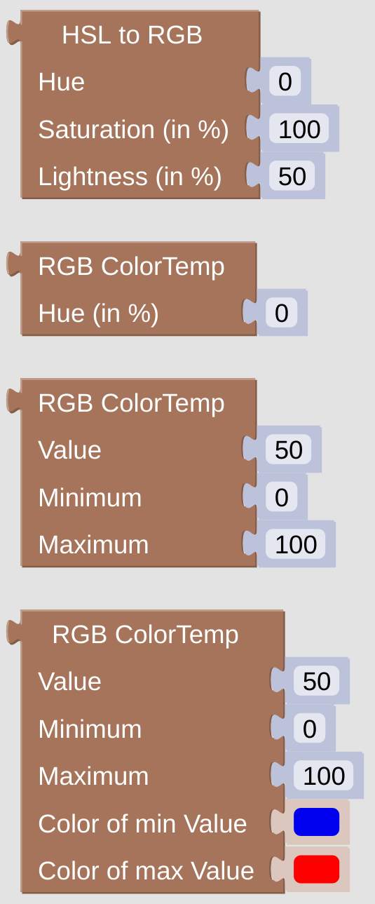

# openhab-blockly-colorrangetools

openHAB 4 blockLibrary to create colorRanges

## HSL to RGB

You can create any color by defining the HSL (Hue, Saturation, Lightness) values for it. See also the [related wikipedia article](https://en.wikipedia.org/wiki/HSL_and_HSV) for some description.

## RGB ColorTemp

The three *RGB ColorTemp* helpers are made to convert a user supplied value into some color from a color-spectrum of two values. Usually this spectrum is ranging from red]([HTML Color Picker](https://www.w3schools.com/colors/colors_picker.asp?colorhex=ff0000)) (HSL[0, 100%, 50%]) to [blue](https://www.w3schools.com/colors/colors_picker.asp?colorhex=0000ff) (HSL[250,100%, 50%]), from warm to cold.

The three different helpers are really similar. The first one only receives the percentage of the maximum hue value (250 for blue). Based on this supplied value you will get some color between red and blue.

The second helper lets you define the minimum and maximum values of the value you are going to supply. These ranges can also be negative, therefore you can for instance give *-5* as minimum, *30* as maximum for your usual temperature display.

With the last helper you can additionally define the ending colors of the spectrum you are going to use. This way you can use blue to red for temperatures, but also green to red for network speeds and the like.